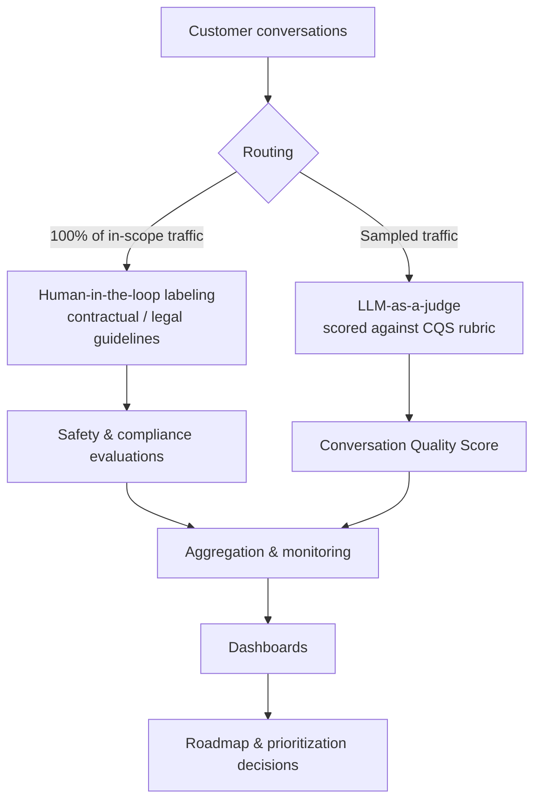

# Conversation Quality Score (CQS) — Evaluation System for a Customer-Facing Agentic AI Assistant

A two-tier quality measurement system — **100% human-in-the-loop coverage for safety/compliance** plus a scalable **LLM-as-a-judge** auto-evaluation — built to give a GenAI shopping assistant a single, comparable measure of conversation quality that product and engineering teams can act on.

> Generalized case study of work I led at Walmart on **Sparky**, Walmart's customer-facing agentic AI shopping assistant. It contains no proprietary code, data, or confidential implementation details. Public product facts are drawn from Walmart's public disclosures.

| | |
|---|---|
| **Role** | Owned the metric, evaluation design, requirements, and rollout (Principal Product Data Analyst, Agentic AI) |
| **Partners** | Data Science, Engineering, Legal, Product |
| **Domain** | Conversational / agentic AI, LLM evaluation, product quality |
| **Methods** | LLM-as-a-judge, human-in-the-loop labeling, rubric design, sampling, metric monitoring |

---

## The problem

Sparky scaled to a large share of Walmart's app users, but the team had no standardized, comparable way to measure *conversation quality* across dozens of domains. Two constraints pulled in opposite directions:

- **Compliance** required full evaluation coverage of certain interactions under contractual and legal guidelines — something only human reviewers could satisfy.
- **Scale** made it impossible to human-review every conversation for quality; manual review couldn't keep pace with traffic or cost.

Without a shared quality signal, teams couldn't tell whether a change helped or hurt, and prioritization debates lacked a common yardstick.

## Goals & non-goals

**Goals**
- A single, standardized quality KPI (CQS) comparable across domains and over time.
- Full evaluation coverage where compliance requires it.
- A quality signal that scales to daily traffic at acceptable cost.
- Output that feeds roadmap and prioritization decisions.

**Non-goals**
- Replacing human judgment on safety-critical review.
- Real-time, in-line gating of responses (this system measures and monitors; it does not block at inference time).

## System design

The core decision was to **split evaluation into two tracks** rather than force one method to do both jobs.



**Track 1 — Compliance & safety (human-in-the-loop).** All in-scope traffic is routed to human labelers who evaluate against contractual/legal guidelines, producing defensible, audit-ready safety coverage.

**Track 2 — Quality at scale (LLM-as-a-judge).** A sampled stream of conversations is scored by a frontier LLM against a defined quality rubric, producing the CQS. This delivers a quality signal at a fraction of the cost and time of manual review.

## CQS rubric (generalized)

Each sampled conversation is scored across quality dimensions such as relevance, helpfulness, correctness, and tone, then combined into a single score. The rubric is versioned so changes to the definition are explicit and comparable over time.

## LLM-as-a-judge design notes

- The judge is prompted with the rubric plus the conversation and returns a **structured score** with rationale, so results are auditable rather than a single opaque number.
- Judge output is **calibrated and monitored against human labels** so the team knows how far to trust the automated signal and can catch drift.
- Designed for roughly **10K conversations/day** at about **90% lower cost per evaluation** than full manual review — the economics that make platform-wide quality measurement feasible.

## Key decisions & tradeoffs

- **Two tracks instead of one.** Compliance needs 100% human coverage; quality needs scale. One method couldn't satisfy both without either blowing the budget or failing the compliance bar.
- **Sampling for the quality track.** Full LLM coverage was unnecessary for a stable quality signal; sampling balanced cost against statistical confidence.
- **Auditable judge output.** Returning rationale alongside scores traded a little latency/cost for trust and debuggability — worth it for a metric teams make decisions on.
- **Calibration as a first-class requirement.** A judge that drifts from human judgment is worse than no judge; agreement monitoring was built in, not bolted on.

## Impact

- Established the platform's **first standardized quality KPI**, now used by product and engineering to prioritize improvements.
- **~10K conversations/day** auto-evaluated for quality at **~90% lower cost per evaluation** than manual review.
- Full, audit-ready coverage on the compliance track.

*(Public context: Sparky is used by roughly half of Walmart's app users, who place orders ~35% larger than non-users — per Walmart's public disclosures.)*

## What I'd build next

- Automated alerting on judge-vs-human agreement drift.
- Active-learning sampling that oversamples uncertain or low-scoring conversations.
- Per-domain rubric tuning where quality means different things (e.g., reorder vs. discovery).

## Tech & methods

`LLM-as-a-judge` · `prompt & rubric design` · `human-in-the-loop labeling` · `sampling` · `metric calibration & monitoring` · `SQL` · `Python` · `Tableau / Power BI`

---

### Repo structure (suggested)

```
.
├── README.md            # this case study
├── docs/
│   ├── rubric.md         # generalized CQS rubric & scoring guide
│   └── architecture.md   # deeper design notes + diagram
└── demo/                 # optional: runnable LLM-as-a-judge harness on synthetic data
    ├── judge.py
    └── sample_conversations.json
```

> Want to see it run? An optional `demo/` can showcase a minimal LLM-as-a-judge harness scored on **synthetic** conversations — demonstrating the approach end-to-end without any proprietary data.
