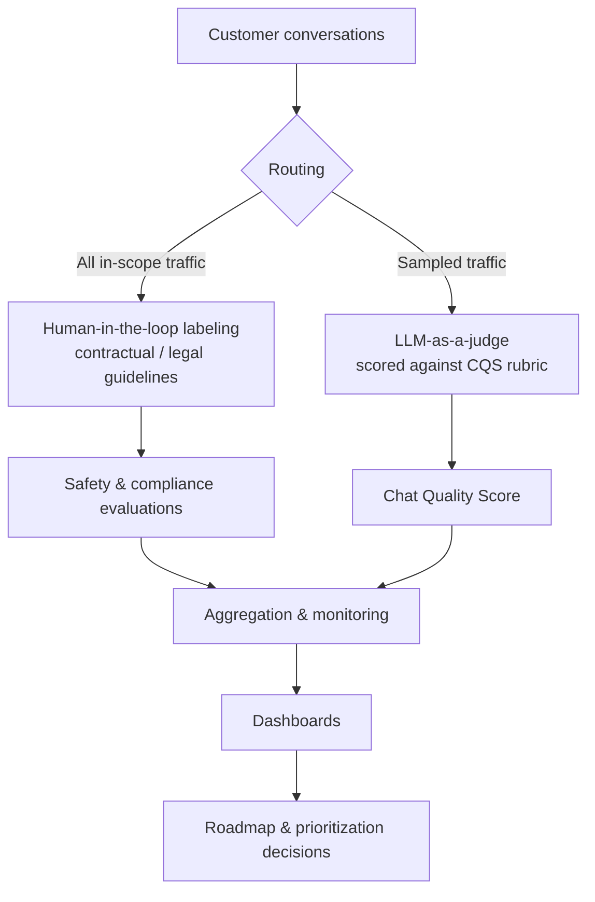

# Chat Quality Score (CQS) — Evaluation System for a Customer-Facing Agentic AI Assistant

A two-tier quality measurement system — **full human-in-the-loop coverage for safety/compliance** plus a scalable **LLM-as-a-judge** auto-evaluation — built to give a customer-facing GenAI shopping assistant a single, comparable measure of conversation quality that product and engineering teams can act on.

> Generalized, anonymized case study based on real product work. It names no employer, product, or person, contains no proprietary code, data, or confidential implementation details, and uses only illustrative figures. It is written to communicate the design approach, not any specific company's system.

| | |
|---|---|
| **Role** | Owned the metric, evaluation design, requirements, and rollout (product data / analytics lead, agentic AI) |
| **Partners** | Data Science, Engineering, Legal, Product |
| **Domain** | Conversational / agentic AI, LLM evaluation, product quality |
| **Methods** | LLM-as-a-judge, human-in-the-loop labeling, rubric design, sampling, metric monitoring |

---

## The problem

The assistant scaled to a large share of the app's users, but the team had no standardized, comparable way to measure *conversation quality* across dozens of domains. Two constraints pulled in opposite directions:

- **Compliance** required full evaluation coverage of certain interactions under contractual and legal guidelines — something only human reviewers could satisfy.
- **Scale** made it impossible to human-review every conversation for quality; manual review couldn't keep pace with traffic or cost.

Without a shared quality signal, teams couldn't tell whether a change helped or hurt, and prioritization debates lacked a common yardstick.

## Goals & non-goals

**Goals**
- A single, standardized quality KPI (CQS) comparable across domains and over time.
- Full evaluation coverage where compliance requires it.
- A quality signal that scales to daily traffic at acceptable cost.
- Output that feeds roadmap and prioritization decisions.

**Non-goals**
- Replacing human judgment on safety-critical review.
- Real-time, in-line gating of responses (this system measures and monitors; it does not block at inference time).

## System design

The core decision was to **split evaluation into two tracks** rather than force one method to do both jobs.



**Track 1 — Compliance & safety (human-in-the-loop).** All in-scope traffic is routed to human labelers who evaluate against contractual/legal guidelines, producing defensible, audit-ready safety coverage.

**Track 2 — Quality at scale (LLM-as-a-judge).** A sampled stream of conversations is scored by a frontier LLM against a defined quality rubric, producing the CQS. This delivers a quality signal at a fraction of the cost and time of manual review.

## CQS rubric (generalized)

Each sampled conversation is scored across quality dimensions such as relevance, helpfulness, correctness, and tone, then combined into a single score. The rubric is versioned so changes to the definition are explicit and comparable over time.

## LLM-as-a-judge design notes

- The judge is prompted with the rubric plus the conversation and returns a **structured score** with rationale, so results are auditable rather than a single opaque number.
- Judge output is **calibrated and monitored against human labels** so the team knows how far to trust the automated signal and can catch drift.
- Designed for high daily conversation volume at a small fraction of the cost per evaluation of full manual review — the economics that make platform-wide quality measurement feasible.

## Key decisions & tradeoffs

- **Two tracks instead of one.** Compliance needs full human coverage; quality needs scale. One method couldn't satisfy both without either blowing the budget or failing the compliance bar.
- **Sampling for the quality track.** Full LLM coverage was unnecessary for a stable quality signal; sampling balanced cost against statistical confidence.
- **Auditable judge output.** Returning rationale alongside scores traded a little latency/cost for trust and debuggability — worth it for a metric teams make decisions on.
- **Calibration as a first-class requirement.** A judge that drifts from human judgment is worse than no judge; agreement monitoring was built in, not bolted on.

## Impact

- Established the platform's **first standardized quality KPI**, used by product and engineering to prioritize improvements.
- Auto-evaluated quality at high daily volume and a small fraction of the cost per evaluation of manual review.
- Full, audit-ready coverage on the compliance track.

## What I'd build next

- Automated alerting on judge-vs-human agreement drift.
- Active-learning sampling that oversamples uncertain or low-scoring conversations.
- Per-domain rubric tuning where quality means different things (e.g., reorder vs. discovery).

## Tech & methods

`LLM-as-a-judge` · `prompt & rubric design` · `human-in-the-loop labeling` · `sampling` · `metric calibration & monitoring` · `SQL` · `Python` · `BI dashboards`

---

### Repo structure

```
.
├── README.md            # how to run the demo app
├── streamlit_app.py     # evaluation console (Benchmark, Score-your-own, Rubric)
├── cqs_judge.py         # rubric, mock judge, and real LLM judge
├── evaluate.py          # command-line evaluator
└── data/
    └── conversation_pool.json   # synthetic conversations
```

> This repository is a runnable demonstration of the approach: a minimal LLM-as-a-judge harness scored on **synthetic** conversations, demonstrating the design end-to-end without any proprietary data.
